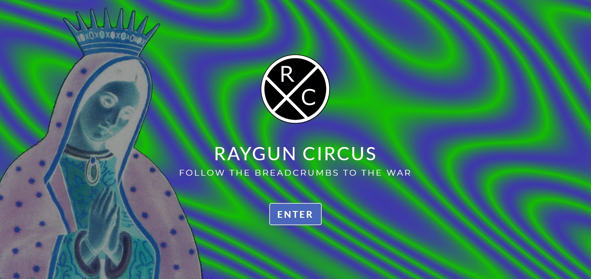

# Raygun Circus Official Website

# Project Description

This is the official website for Raygun Circus, an indie band from San Diego. The website includes a landing page, a bio page, a page of the band's releases in chronological order, a music page with audio, a video page with embedded YouTube videos, a page with links to various related musical projects and collaborations, and a contact page where users can send messages to the band. Other pages include a gallery of fliers from past shows (Street of Little Girls), as well as pages to album lyrics (Cori Celesti).

This responsive front-end website was created using JavaScript, Bootstrap, CSS, and HTML. The contact form is processed by enformed.io, and Animate.css is used for the animated bounce-in effect. The fonts used ('Cormorant Infant' and 'Lato') come from Google Fonts. The social icons used in the footer and in the navbar of certain band pages come from Font Awesome. The animated icon that is displayed on the success page when a message from the contact form has been sent successfully comes from Material Design. Lightbox by Lokesh Dhakar is used to overlay images on the current page the user is on. When an image is clicked (e.g. album cover), the image is displayed by filling the screen and dimming out the rest of the web page (see screenshot #4 below). The videos used are embedded YouTube videos, and are responsive as well.

Open Graph Tags have been added so that when a link to or from the website is shared and posted (e.g. on Facebook), the desired image and text will be shown (see screenshot #5 below). A sitemap has been added and submitted to Google, and Google Search Console is used for this website to check the indexing status and to optimize the visibility of the website.

# Technologies Used

* JavaScript
* Enformed.io
* Lightbox
* Animate.css
* Bootstrap
* CSS
* HTML

# Raygun Circus Official Website

Please check out the link below for the official Raygun Circus website:

https://rayguncircus.com/

# Screenshots

