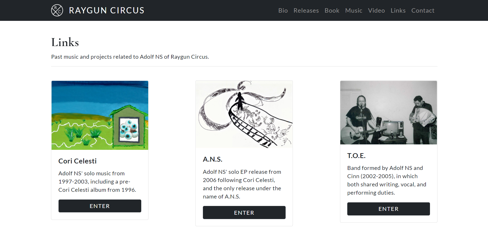

# Raygun Circus Official Website

# Project Description

Raygun Circus is the official website for Raygun Circus, an indie band from San Diego. The website includes a landing page, a bio page, a page of the band's releases in chronological order, a music page with audio, a video page with embedded YouTube videos, and a page with links to various related musical projects and collaborations. Other pages include a gallery of fliers from past shows (Street of Little Girls), as well as pages to certain album lyrics (Cori Celesti).

This website was created using Bootstrap, HTML, and CSS. The fonts used ('Cormorant Infant' and 'Lato') come from Google Fonts. The social icons used in the footer and in the navbar of certain band pages come from Font Awesome. Lightbox by Lokesh Dhakar is used to overlay images on the current page. When an image is clicked (e.g. album cover), the image is displayed by filling the screen, and dimming out the rest of the web page (see screenshot #4 below). The videos on the videos page are embedded YouTube videos.

Open Graph Tags have been added so that when a link from the website is shared and posted (e.g. on Facebook), the desired image and text will be shown (see screenshot #5 below). A site map has been added and submitted to Google, and Google Search Console is used for this website to check the indexing status and to optimize the visibility of the website.

# Technologies Used

* Lightbox
* JavaScript
* Bootstrap
* CSS
* HTML

# Raygun Circus Official Website

Please check out the link below for the official Raygun Circus website:

https://rayguncircus.com/

# Screenshots

